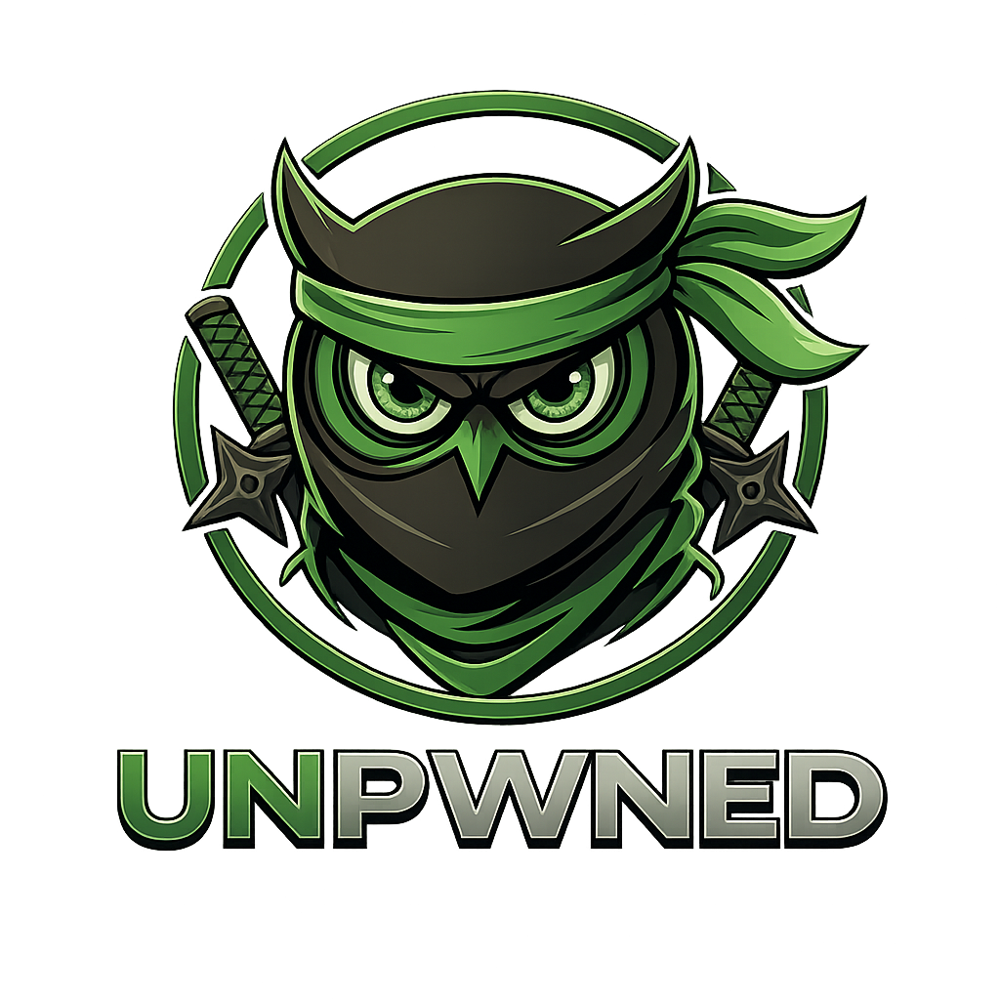

<p align="center">
  
</p>

<p align="center">
  <strong>UNPWNED Security Scan - GitHub Action</strong><br>
  <em>8 security checks on every push. Fail the build on critical findings.</em>
</p>

<p align="center">
  <a href="https://github.com/marketplace/actions/unpwned-security-scan"></a>
  <a href="https://www.npmjs.com/package/unpwned"></a>
  <a href="https://github.com/razazu/unpwned-action/stargazers"></a>
  <a href="https://github.com/razazu/unpwned-action/blob/main/LICENSE"></a>
</p>

<br>

```yaml
- uses: razazu/unpwned-action@v1
  with:
    domain: yoursite.com
```

<p align="center">
  
</p>

---

## Why?

Security regressions slip in quietly. A missing header, a forgotten `.env`, an expired certificate. By the time you notice, your users already paid the price.

**unpwned-action** runs the UNPWNED security scanner on every push or pull request, catches regressions before they merge, and fails the build on critical findings. Zero config. No accounts. No API keys.

## What It Checks

```
  Headers         ███░░░░░░░   25/100  [5 issues]
  SSL/TLS         ██████████  100/100  [PASS]
  DNS Security    ██░░░░░░░░   20/100  [3 issues]
  Cookies         ██████████  100/100  [PASS]
  CORS            ███████░░░   70/100  [1 issue]
  Sensitive Files ██████████  100/100  [PASS]
  Tech Stack      Next.js, Vercel
  Breaches        No known breaches
```

| Check | What It Finds |
|:------|:--------------|
| **Security Headers** | Missing CSP, HSTS, X-Frame-Options, X-Content-Type-Options, Referrer-Policy, Permissions-Policy |
| **SSL/TLS** | Expired certs, weak protocols, self-signed certificates, expiry warnings |
| **DNS Security** | Missing SPF, DMARC, DKIM, DNSSEC |
| **Cookie Security** | Missing Secure, HttpOnly, SameSite flags |
| **CORS Policy** | Wildcard origins, credential leaks, origin reflection attacks |
| **Sensitive Files** | Exposed `.env`, `.git/config`, `package.json`, `wp-config.php`, and more |
| **Tech Stack** | Detects Next.js, React, Angular, WordPress, nginx, Cloudflare, and others |
| **Data Breaches** | Known breaches from Have I Been Pwned database |

## Quick Start

Drop this into `.github/workflows/security.yml`:

```yaml
name: Security Scan
on: [push, pull_request]

jobs:
  scan:
    runs-on: ubuntu-latest
    steps:
      - uses: razazu/unpwned-action@v1
        with:
          domain: yoursite.com
```

On every push, the Actions tab shows a scan summary with score, grade, and a severity breakdown. By default, the workflow fails on **critical** findings.

## Inputs

| Name | Required | Default | Description |
|:-----|:---------|:--------|:------------|
| `domain` | yes | - | Domain or URL to scan (e.g. `example.com`) |
| `fail-on` | no | `critical` | Fail workflow on: `critical`, `high`, `medium`, `low`, `none` |
| `comment-on-pr` | no | `false` | Post results as a PR comment (needs `pull-requests: write`) |

## Outputs

| Name | Description |
|:-----|:------------|
| `score` | Overall security score (0-100) |
| `grade` | Security grade (A+ to F) |
| `critical` | Count of critical severity findings |
| `high` | Count of high severity findings |
| `medium` | Count of medium severity findings |
| `low` | Count of low severity findings |
| `report-path` | Path to the full JSON report for downstream steps |

## Examples

### Fail the build on high or critical findings

```yaml
- uses: razazu/unpwned-action@v1
  with:
    domain: example.com
    fail-on: high
```

### Comment the scan results on pull requests

```yaml
name: PR Security Scan
on: pull_request

permissions:
  pull-requests: write

jobs:
  scan:
    runs-on: ubuntu-latest
    steps:
      - uses: razazu/unpwned-action@v1
        with:
          domain: example.com
          comment-on-pr: true
```

Every PR gets an automatic comment with the current score and severity breakdown, so reviewers can spot regressions before approving.

### Use outputs in later steps

```yaml
- id: scan
  uses: razazu/unpwned-action@v1
  with:
    domain: example.com

- name: Alert team when score drops
  if: ${{ steps.scan.outputs.score < 70 }}
  run: |
    curl -X POST ${{ secrets.SLACK_WEBHOOK }} \
      -d '{"text":"Security score dropped to ${{ steps.scan.outputs.score }}"}'
```

### Upload the full JSON report as an artifact

```yaml
- id: scan
  uses: razazu/unpwned-action@v1
  with:
    domain: example.com

- uses: actions/upload-artifact@v4
  with:
    name: unpwned-report
    path: ${{ steps.scan.outputs.report-path }}
```

### Scheduled weekly audit

```yaml
name: Weekly Security Audit
on:
  schedule:
    - cron: '0 9 * * 1'  # Every Monday at 9am

jobs:
  audit:
    runs-on: ubuntu-latest
    steps:
      - uses: razazu/unpwned-action@v1
        with:
          domain: example.com
          fail-on: none
```

## Scoring

Weighted average across all checks:

| Check | Weight | Why |
|:------|:-------|:----|
| Security Headers | 25% | First line of defense against XSS, clickjacking, MIME sniffing |
| SSL/TLS | 20% | Encryption in transit is non-negotiable |
| DNS Security | 20% | Email spoofing protection (SPF/DMARC/DKIM) |
| Cookie Security | 10% | Session hijacking prevention |
| CORS Policy | 10% | Cross-origin data theft protection |
| Sensitive Files | 10% | Exposed configs and credentials |
| Tech Stack | 5% | Informational (no score penalty) |

### Grades

| Grade | Score | Meaning |
|:------|:------|:--------|
| **A+** | 95-100 | Excellent security posture |
| **A** | 85-94 | Strong, minor improvements possible |
| **B** | 70-84 | Good, some gaps to address |
| **C** | 50-69 | Fair, significant improvements needed |
| **D** | 30-49 | Poor, critical issues present |
| **F** | 0-29 | Failing, immediate action required |

## How It Compares

| Tool | Headers | SSL | DNS | Cookies | CORS | Files | Breaches | PR Comment | Free |
|:-----|:--------|:----|:----|:--------|:-----|:------|:---------|:-----------|:-----|
| **unpwned-action** | Yes | Yes | Yes | Yes | Yes | Yes | Yes | Yes | Yes |
| Snyk | - | - | - | - | - | - | - | Yes | Limited |
| Mozilla Observatory | Yes | - | - | - | - | - | - | - | Yes |
| Lighthouse CI | Partial | - | - | - | - | - | - | Yes | Yes |

## Runner Compatibility

The action is a composite action that uses `bash` and `jq`. It runs on:

- `ubuntu-latest` ✅ (recommended, fully supported)
- `macos-latest` ✅ (`jq` available by default)
- `windows-latest` ⚠️ (requires bash shell, use WSL or `shell: bash`)

## Requirements

- GitHub-hosted runner or self-hosted runner with Node.js 18+ and `jq`
- No authentication required
- No secrets needed

## Want More?

This action covers 8 checks. The full [**UNPWNED**](https://www.unpwned.io?ref=action) platform adds:

- **700+ security checks** (vs 8 in this action)
- **AI-powered fix prompts** - copy and paste into Claude or Cursor
- **Continuous monitoring** - alerts on score drops or new CVEs
- **PDF security reports** - client-ready deliverables
- **GitHub Issues integration** - auto-create issues from findings
- **Database exposure checks** - Supabase RLS, Firebase rules, S3 buckets
- **CVE and dependency scanning** - known vulnerabilities in your stack
- **SEO spam injection detection** - catch cloaking and ghost pages
- **OWASP, SOC2, GDPR compliance checks**

<p align="center">
  <a href="https://www.unpwned.io?ref=action"><strong>Run a full scan at unpwned.io &rarr;</strong></a>
</p>

## Related

- [UNPWNED CLI](https://github.com/razazu/unpwned-cli) - Run the same scan from your terminal
- [UNPWNED Web](https://unpwned.io) - Full platform with 700+ checks and AI fix prompts

## Contributing

Contributions welcome. Open an issue or a PR.

```bash
git clone https://github.com/razazu/unpwned-action.git
cd unpwned-action
# Edit action.yml, README.md
# Push a branch, open a PR
```

The self-test workflow (`.github/workflows/test.yml`) runs the action against `unpwned.io` on every push and must pass before merging.

## License

[MIT](LICENSE) &copy; [Raz Azulay](https://github.com/razazu)

<p align="center">
  <sub>Built at <a href="https://www.unpwned.io">UNPWNED</a></sub>
</p>
